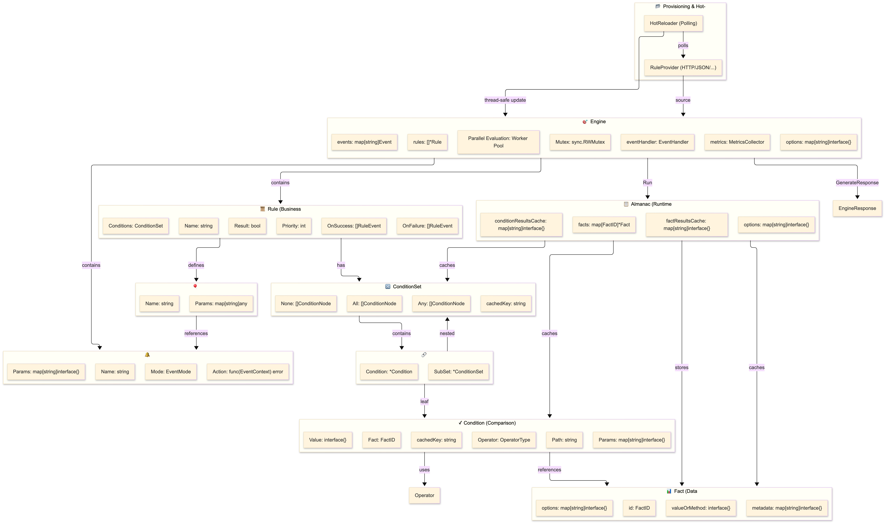
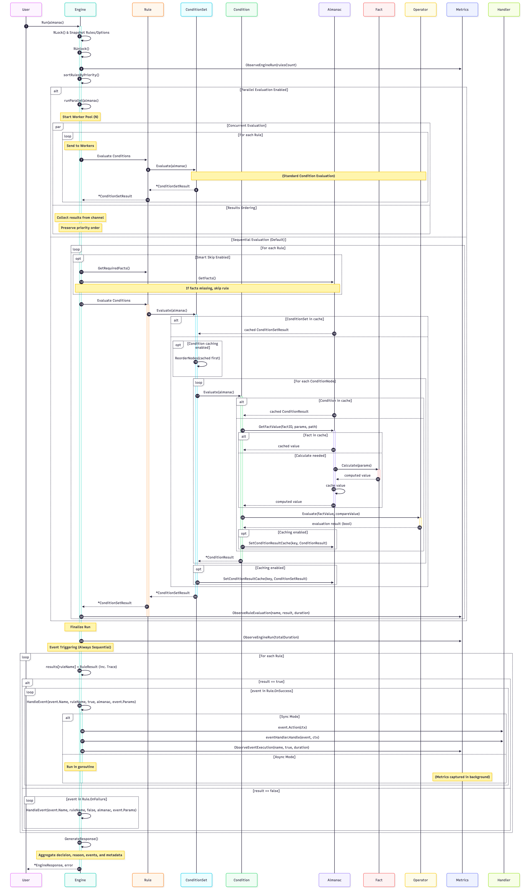
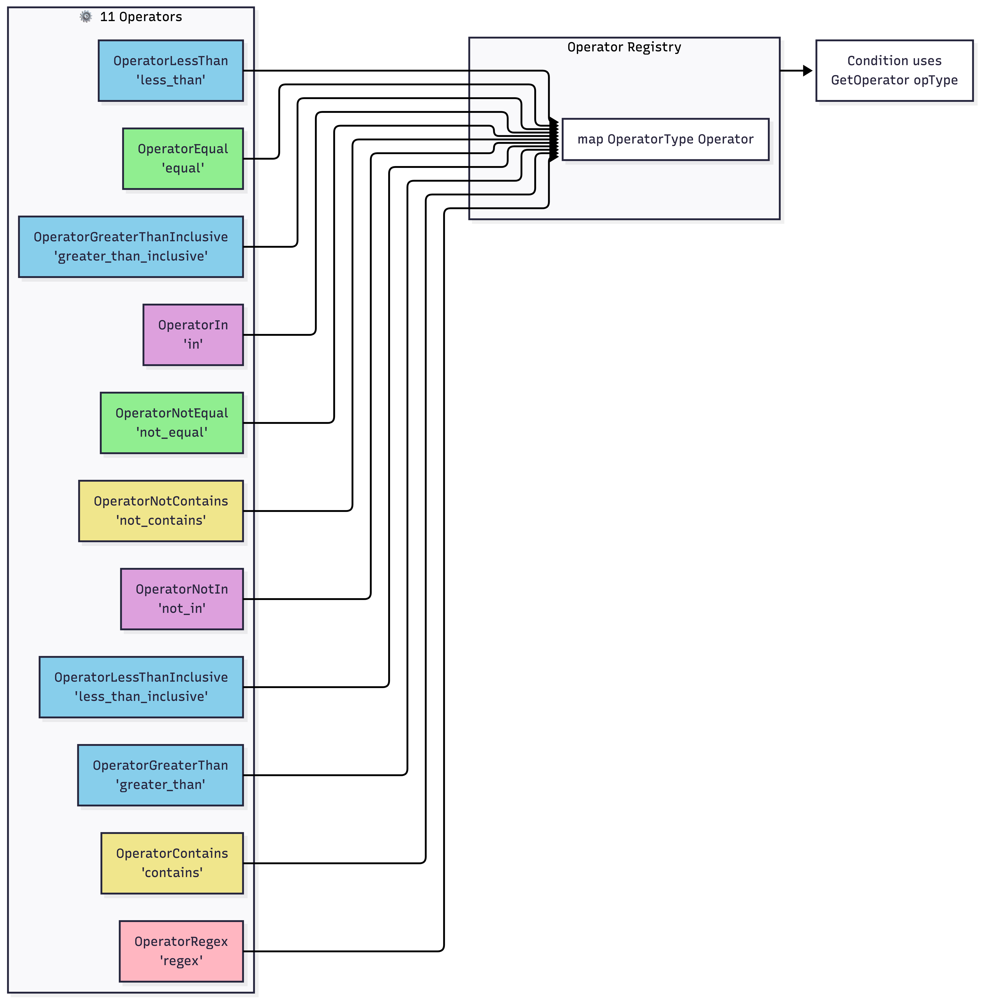
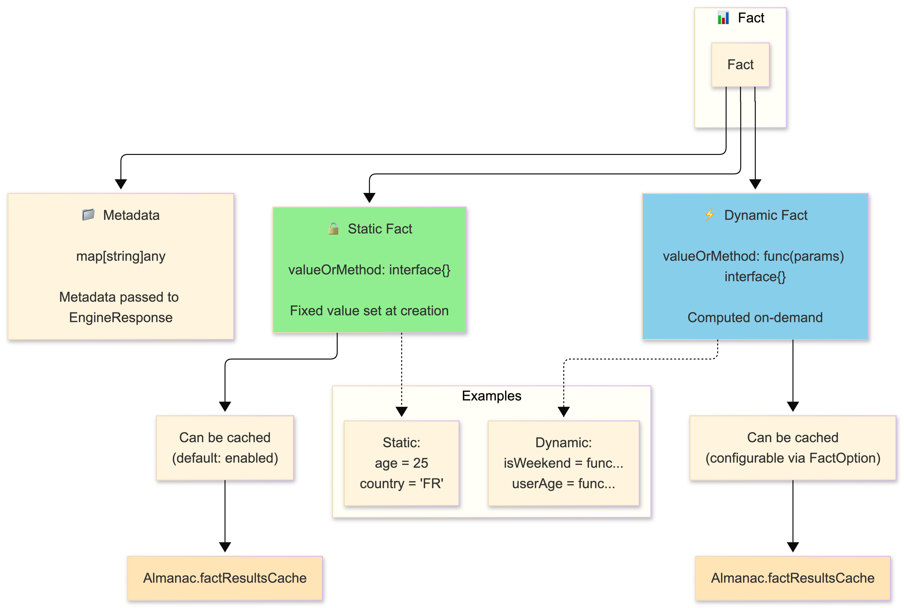
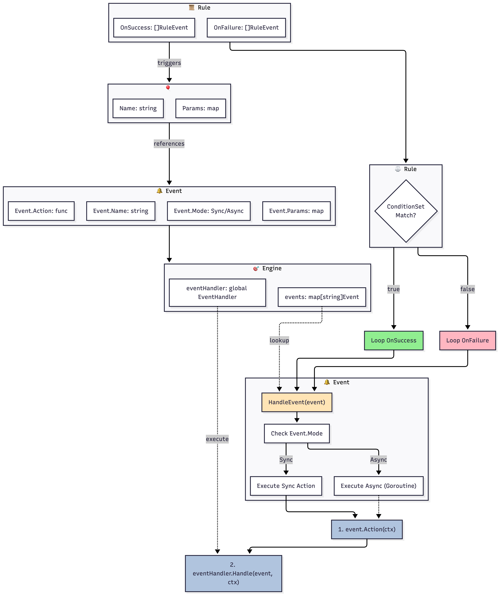

# 🚀 Go Rules Engine

[](https://go.dev/)
[](https://github.com/deadelus/go-rules-engine)
[](LICENSE)

A powerful and flexible business rules engine for Go, inspired by [json-rules-engine](https://github.com/CacheControl/json-rules-engine). Evaluate complex conditions and trigger events based on dynamic facts.

## ✨ Features

- 🎯 **JSON or Code-defined Rules** - Load rules from JSON files or create them directly in Go
- 🔄 **Complex Conditions** - Support `all`, `any`, and `none` operators with infinite nesting
- 📊 **Rich Operators** - 11 built-in operators including `equal`, `greater_than`, `contains`, `regex` and more
- 🎪 **Event System** - Custom callbacks and global handlers to react to results
- 💾 **Dynamic Facts** - Compute values on-the-fly with callbacks
- 🧮 **JSONPath Support** - Access nested data with `$.path.to.value`
- ⚡ **Rule Priorities** - Control evaluation order with configurable priority sorting (ASC/DESC)
- ⚡ **High Performance** - Condition caching, pre-calculation of cache keys, and smart skipping of rules
- 🔍 **Audit Trace** - Full evaluation tree with fact values, compatible with caching and JSON serialization
- 🔒 **Thread-safe** - Protected by mutexes for concurrent usage
- 🔥 **Hot-reload Support** - Update rules from remote sources (HTTP) without restarting
- ✅ **100% Test Coverage** - Robust and thoroughly tested code

## 📦 Installation

```bash
go get github.com/deadelus/go-rules-engine
```

## 🚀 Quick Start

Find all our detailed examples in the [docs/examples](./docs/examples/README.md) folder.

## 📖 Documentation

### Architecture

For a complete visual architecture, see the [detailed architecture documentation](docs/diagrams/README.md) with Mermaid diagrams.

#### System Overview



The rules engine is composed of several key components working together:



#### 1. **Engine** - The main engine

```go
// Default engine (with descending priority sorting)
engine := gre.NewEngine()

// Engine with custom sorting
sortOrder := gre.SortRuleASC
engine := gre.NewEngine(gre.WithPrioritySorting(&sortOrder))

// Engine without priority sorting (insertion order)
engine := gre.NewEngine(gre.WithoutPrioritySorting())
```

**Configuration Options:**
- `WithPrioritySorting(*SortRule)` - Enable priority sorting (default: DESC)
  - `SortRuleASC` - Sort by ascending priority (lower first)
  - `SortRuleDESC` - Sort by descending priority (higher first, default)
- `WithoutPrioritySorting()` - Disable priority sorting (evaluate rules in insertion order)
- `WithParallelExecution(workers)` - Enable parallel evaluation with N workers
- `WithoutParallelExecution()` - Disable parallel evaluation (sequential order)
- `WithConditionCaching()` - Enable condition results caching
- `WithoutConditionCaching()` - Disable condition results caching
- `WithSmartSkip()` - Enable skipping rules with missing facts
- `WithAuditTrace()` - Enable detailed audit trace
- `WithoutAuditTrace()` - Disable detailed audit trace

**Methods:**
- `AddRule(rule *Rule)` - Add a rule to the engine
- `RegisterEvent(event Event)` - Register a named event (with its action and mode)
- `SetEventHandler(handler EventHandler)` - Set a global event handler for all events
- `Run(almanac *Almanac) (*Engine, error)` - Execute all rules (returns engine for logical chaining)
- `Results() map[string]*RuleResult` - Get detailed results of the last execution
- `ReduceResults() map[string]bool` - Get pass/fail results for each rule
- `GenerateResponse() *EngineResponse` - Get a consolidated, JSON-marshalable response


#### 2. **Rule** - A business rule

```go
rule := &gre.Rule{
    Name:       "adult-check",
    Priority:   10,          // Higher = executed first
    Conditions: conditionSet,
    OnSuccess:  []gre.RuleEvent{{Name: "approve-user"}, {Name: "send-welcome-email"}},
    OnFailure:  []gre.RuleEvent{{Name: "reject-user"}},
}
```

#### 3. **Condition** - A condition to evaluate



```go
condition := &gre.Condition{
    Fact:     "age",
    Operator: "greater_than",
    Value:    18,
    Path:     "$.user.age", // Optional: JSONPath for nested data
}
```

**Available Operators:**
- `equal` - Equality
- `not_equal` - Not equal to
- `greater_than` - Greater than
- `greater_than_inclusive` - Greater than or equal to
- `less_than` - Less than
- `less_than_inclusive` - Less than or equal to
- `in` - In the list
- `not_in` - Not in the list
- `contains` - Contains (for strings and arrays)
- `not_contains` - Does not contain
- `regex` - Matches a regular expression pattern (string values only)

#### 4. **ConditionSet** - Condition grouping

```go
// All conditions must be true (AND)
conditionSet := gre.ConditionSet{
    All: []gre.ConditionNode{
        {Condition: &condition1},
        {Condition: &condition2},
    },
}

// At least one condition must be true (OR)
conditionSet := gre.ConditionSet{
    Any: []gre.ConditionNode{
        {Condition: &condition1},
        {Condition: &condition2},
    },
}

// Nesting (AND of OR)
conditionSet := gre.ConditionSet{
    All: []gre.ConditionNode{
        {Condition: &condition1},
        {
            SubSet: &gre.ConditionSet{
                Any: []gre.ConditionNode{
                    {Condition: &condition2},
                    {Condition: &condition3},
                },
            },
        },
    },
}
```

#### 5. **Almanac** - Facts storage



```go
almanac := gre.NewAlmanac()

// Add simple facts
almanac.AddFact("age", 25)
almanac.AddFact("country", "FR")

// Add dynamic facts
almanac.AddFact("temperature", func(params map[string]interface{}) interface{} {
    // Custom calculation logic
    return fetchTemperature()
})

// Retrieve a fact
value, err := almanac.GetFactValue("age", nil)
```

#### 6. **Event** - Triggered event

```go
event := gre.Event{
    Name: "user-approved",
    Params: map[string]interface{}{
        "userId": 123,
        "reason": "All conditions met",
    },
    Mode: gre.EventModeSync, // or EventModeAsync
    Action: func(ctx gre.EventContext) error {
        fmt.Printf("Action triggered for rule: %s\n", ctx.RuleName)
        return nil
    },
}
```

### Callbacks and Handlers System



The engine provides two ways to handle results:

#### 1. Named Events (Registered in Engine)

Events are registered in the engine and referenced by rules via their `OnSuccess` or `OnFailure` fields.

```go
engine := gre.NewEngine()

// Register the event
engine.RegisterEvent(gre.Event{
    Name: "sendEmail",
    Mode: gre.EventModeSync,
    Action: func(ctx gre.EventContext) error {
        fmt.Printf("Sending email for rule: %s\n", ctx.RuleName)
        return nil
    },
})

// Rule referencing the event
rule := &gre.Rule{
    Name:      "email-rule",
    OnSuccess: []gre.RuleEvent{{Name: "sendEmail"}},
    // ...
}
```

#### 2. Global Event Handler

You can set a global handler that will be called for EVERY event triggered by the engine. This is useful for logging, metrics, or centralized processing.

```go
type MyGlobalHandler struct{}

func (h *MyGlobalHandler) Handle(event gre.Event, ctx gre.EventContext) error {
    fmt.Printf("🌍 Global handler: Event %s triggered by rule %s (Result: %v)\n", 
        event.Name, ctx.RuleName, ctx.Result)
    return nil
}

engine.SetEventHandler(&MyGlobalHandler{})
```

#### Synchronous vs Asynchronous Execution

You can control whether an event is executed synchronously (blocking the engine's `Run` loop) or asynchronously (in a separate goroutine).

```go
// Synchronous event (default)
syncEvent := gre.Event{
    Name: "sync-event",
    Mode: gre.EventModeSync,
    Action: func(ctx gre.EventContext) error {
        // Blocks the engine until finished
        return nil
    },
}

// Asynchronous event
asyncEvent := gre.Event{
    Name: "async-event",
    Mode: gre.EventModeAsync,
    Action: func(ctx gre.EventContext) error {
        // Runs in a background goroutine
        return nil
    },
}
```

### JSONPath Support

Access nested data in your facts:

```go
almanac := gre.NewAlmanac([]*gre.Fact{})
almanac.AddFact("user", map[string]interface{}{
    "profile": map[string]interface{}{
        "age": 25,
        "address": map[string]interface{}{
            "city": "Paris",
        },
    },
})

// Use JSONPath in conditions
condition := &gre.Condition{
    Fact:     "user",
    Path:     "$.profile.address.city",
    Operator: "equal",
    Value:    "Paris",
}
```

### Regex Pattern Matching

Use the `regex` operator to match string values against regular expression patterns:

```go
engine := gre.NewEngine()

// Rule to validate email format
emailRule := &gre.Rule{
    Name:     "validate-email",
    Priority: 10,
    Conditions: gre.ConditionSet{
        All: []gre.ConditionNode{
            {
                Condition: &gre.Condition{
                    Fact:     "email",
                    Operator: "regex",
                    Value:    "^[a-zA-Z0-9._%+-]+@[a-zA-Z0-9.-]+\\.[a-zA-Z]{2,}$",
                },
            },
        },
    },
    OnSuccess: []gre.RuleEvent{{Name: "valid-email-event"}},
}

engine.AddRule(emailRule)

almanac := gre.NewAlmanac([]*gre.Fact{})
almanac.AddFact("email", "user@example.com")

results, _ := engine.Run(almanac)
// Will match if email is valid
```

### 📋 Formatted API Response

The engine provides a `GenerateResponse()` method that aggregates all rule results into a single, clean structure designed for API responses. It consolidates the decision, reasons (audit trace), triggered events, and fact metadata.

#### 1. Define Rules in JSON

```json
[
  {
    "name": "premium-access",
    "priority": 100,
    "conditions": {
      "all": [
        { "fact": "user_status", "operator": "equal", "value": "vip" },
        { "fact": "age", "operator": "greater_than_inclusive", "value": 18 }
      ]
    },
    "onSuccess": [
        { "name": "grant-access", "params": { "tier": "platinum" } }
    ],
    "onFailure": [
        { "name": "restrict-access" }
    ]
  }
]
```

#### 2. Get the Response

```go
engine := gre.NewEngine(gre.WithAuditTrace())
// ... load rules and facts ...

e, _ := engine.Run(almanac)
response := e.GenerateResponse()

// Marshalling to JSON
jsonOutput, _ := json.MarshalIndent(response, "", "  ")
fmt.Println(string(jsonOutput))
```

#### 3. Output Example

```json
{
  "decision": "authorize",
  "reason": {
    "type": "all",
    "result": true,
    "results": [
      {
        "condition": {
          "fact": "user_status",
          "operator": "equal",
          "value": "vip",
          "factValue": "vip",
          "result": true
        }
      },
      {
        "condition": {
          "fact": "age",
          "operator": "greater_than_inclusive",
          "value": 18,
          "factValue": 25,
          "result": true
        }
      }
    ]
  },
  "events": [
    {
      "type": "grant-access",
      "params": { "tier": "platinum" }
    }
  ],
  "metadata": {
    "user_status": { "source": "db", "cached": true }
  }
}
```

### Audit Trace & Result Serialization

The engine can collect a detailed "trace" of the evaluation process. This includes not just the final result, but the outcome of every single condition, including the actual fact values retrieved from the Almanac. 

**Note:** Our implementation is fully compatible with caching. When caching is enabled, the engine stores the entire result tree, ensuring that Audit Traces remain complete and detailed even for cached results.

This data is fully serializable to JSON.

#### Enable Audit Trace

```go
engine := gre.NewEngine(
    gre.WithAuditTrace(),
)
```

#### Extract Detailed Results

```go
e, _ := engine.Run(almanac)

// Get detailed trace for all rules
results := e.Results()

// Serialize to JSON
jsonData, _ := json.MarshalIndent(results, "", "  ")
fmt.Println(string(jsonData))

// Or get simple pass/fail map
simpleResults := e.ReduceResults()
```
### 🔥 Hot-reload of Rules

The engine supports dynamic reloading of rules from external sources (like an HTTP API or S3) without stopping evaluation.

```go
engine := gre.NewEngine()

// 1. Create a provider (HTTP source)
provider := gre.NewHTTPRuleProvider("https://api.myapp.com/rules")

// 2. Create and start the reloader
reloader := gre.NewHotReloader(engine, provider, 5 * time.Minute)

// Optional: monitor updates or errors
reloader.OnUpdate(func(rules []*gre.Rule) {
    fmt.Printf("Updated %d rules!\n", len(rules))
})

reloader.Start(context.Background())
```
### Condition Results Caching

Optimize performance by caching the results of condition evaluations. This is particularly useful when multiple rules share identical conditions or when working with expensive dynamic facts.

#### Enable globally via the Engine

```go
// Enabled for all rules and all Almanacs passed to this engine
engine := gre.NewEngine(gre.WithConditionCaching())
```

#### Enable per Almanac

```go
// Enabled only for this specific Almanac
almanac := gre.NewAlmanac(gre.WithAlmanacConditionCaching())
```
### Error Handling

The engine uses a typed error system for better traceability:

```go
results, err := engine.Run(almanac)
if err != nil {
    var ruleErr *gre.RuleEngineError
    if errors.As(err, &ruleErr) {
        fmt.Printf("Type: %s, Message: %s\n", ruleErr.Type, ruleErr.Msg)
    }
}
```

**Error Types:**
- `ErrEngine` - General engine error
- `ErrAlmanac` - Error related to facts (almanac)
- `ErrFact` - Fact calculation error
- `ErrRule` - Error in rule definition
- `ErrCondition` - Condition evaluation error
- `ErrOperator` - Invalid or not found operator
- `ErrEvent` - Error related to events
- `ErrJSON` - JSON parsing error

## ⚡ Advanced Optimizations

The engine includes several advanced performance features for high-throughput environments:

### 1. Condition Caching
Enable caching to reuse results of identical conditions or subtrees (ConditionSets) within a single engine run. This is extremely effective for overlapping conditions across multiple rules. 

Unlike simple boolean caches, we store the full `ConditionResult` and `ConditionSetResult` objects, which means **Audit Traces** remain fully detailed even when using cached values.

```go
engine := gre.NewEngine(
    gre.WithConditionCaching(), 
)
```

### 2. Smart Skip (Dependency Tracking)
The engine can map fact dependencies of rules and skip evaluation if the required facts are not present in the Almanac. This prevents expensive condition evaluations when data is missing.

```go
engine := gre.NewEngine(
    gre.WithSmartSkip(),
)
```

### 3. Rule Compilation
When rules are added to the engine, they are automatically "compiled" (pre-calculating condition keys and dependency maps). This moves processing once from evaluation time to registration time.

### 4. Short-circuit Reordering
The evaluation engine reorders nodes within `All`, `Any`, or `None` condition sets to evaluate nodes with cached results first. This maximizes short-circuit opportunities and minimizes redundant fact fetches.

*Note: This optimization is applied automatically whenever condition caching is enabled.*

## 📊 Performance & Benchmarks

The engine is optimized for high-throughput environments. Below are the benchmarks executed on **Intel(R) Core(TM) i7-8750H CPU @ 2.20GHz** (macOS).

### Execution Speed

| Scenario | Mode | Rules Count | Time per Op | Memory | Allocs |
| :--- | :--- | :--- | :--- | :--- | :--- |
| **Simple Run** | Sequential | 1 | 769 ns | 552 B | 8 |
| | Sequential | 10 | 5.9 µs | 3.6 KB | 56 |
| | Sequential | 100 | 58.2 µs | 36.6 KB | 512 |
| **Caching Impact** | No Cache | 50 | 38.9 µs | 18.3 KB | 262 |
| | **With Cache** | 50 | **14.5 µs** | **8.7 KB** | **62** |
| **Smart Skip** | No Skip | 1 | 6.9 µs | 3.7 KB | 40 |
| | **With Skip** | 1 | **0.8 µs** | **0.4 KB** | **7** |

### Key Takeaways
- **Caching**: Reduces execution time by **~63%** and allocations by **~76%** for shared conditions.
- **Smart Skip**: Avoids unnecessary computations, making evaluations **~8x faster** when facts are missing.
- **Complex Nesting**: Evaluating complex nested conditions (5 levels deep) takes only **~1.6 µs**.

## 🧪 Tests

The project has **100%** test coverage:

```bash
# Run all tests
go test ./src -v

# With coverage
go test ./src -coverprofile=coverage.out
go tool cover -html=coverage.out

# See summary
go tool cover -func=coverage.out | tail -1
# Output: total: (statements) 100.0%
```

## 🔍 Code Quality

The code follows all Go conventions and passes linters without warnings:

```bash
# go vet (static analysis)
go vet ./src/...

# golint (Go style)
golint ./src/...

# Code formatting
go fmt ./src/...
```

**Standards Enforced:**
- ✅ Go naming conventions (CamelCase, no ALL_CAPS)
- ✅ Complete GoDoc documentation on all exports
- ✅ Appropriate error handling
- ✅ Thread-safe code with mutexes
- ✅ Comprehensive tests with 100% coverage

## 🗺️ Roadmap

### ✅ Completed Phases

- [x] Phase 1: Basic structures (Condition, Rule, Fact)
- [x] Phase 2: Almanac and facts management
- [x] Phase 3: Operators (equal, greater_than, less_than, etc.)
- [x] Phase 4: Condition evaluation (all/any, nesting)
- [x] Phase 5: Engine with event system
- [x] Phase 6: JSON support and deserialization
- [x] Phase 7: Advanced features (callbacks, handlers, JSONPath)
- [x] Phase 8: Configurable priority sorting (ASC/DESC/disabled)
- [x] Phase 9: Regex operator for pattern matching
- [x] Phase 10: Ergonomic API and builders
- [x] Phase 11: Performance and optimization
- [x] Phase 12: Metrics, Audit Trace, Hot-reload & API Wrapper
- [x] Complete tests with 100% coverage

## 🤝 Contributing

Contributions are welcome! To contribute:

1. Fork the project
2. Create a branch (`git checkout -b feature/amazing-feature`)
3. Commit your changes (`git commit -m 'Add amazing feature'`)
4. Push to the branch (`git push origin feature/amazing-feature`)
5. Open a Pull Request

**Guidelines:**
- Write tests for all new features
- Maintain 100% coverage
- Follow Go conventions (gofmt, golint)
- Document your public functions

## 📄 License

This project is licensed under the MIT License. See the [LICENSE](LICENSE) file for more details.

**Copyright (c) 2026 Geoffrey Trambolho (@deadelus)**

## 🙏 Acknowledgments

Inspired by [json-rules-engine](https://github.com/CacheControl/json-rules-engine) by CacheControl.

## 📞 Contact

Created by [@deadelus](https://github.com/deadelus)

---

⭐ Don't forget to star if this project helps you!
