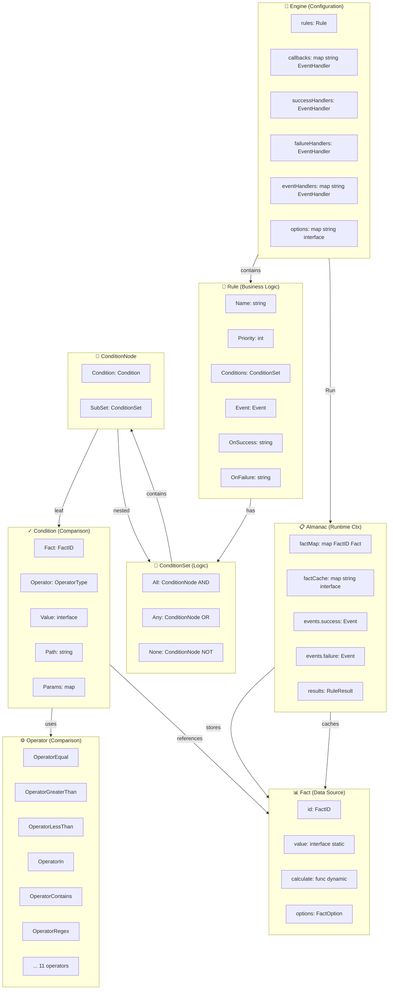
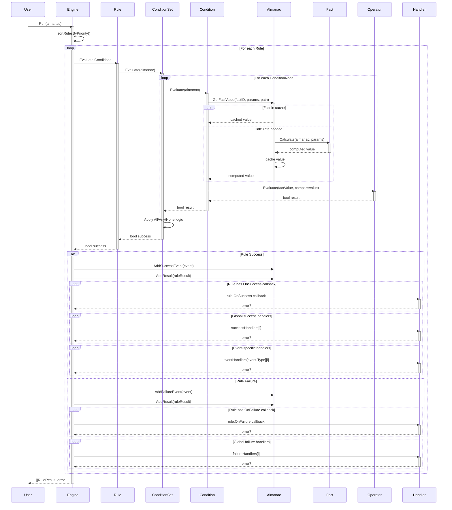
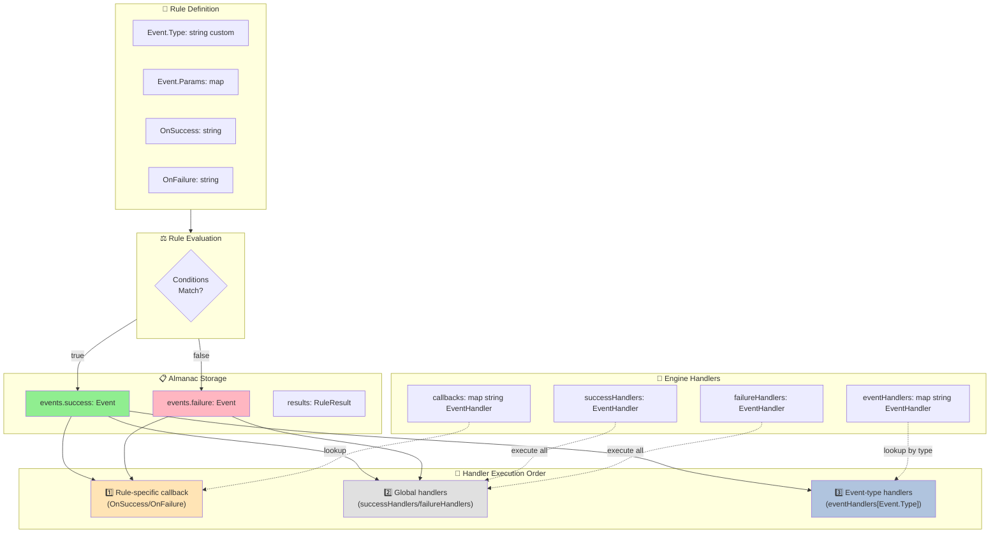
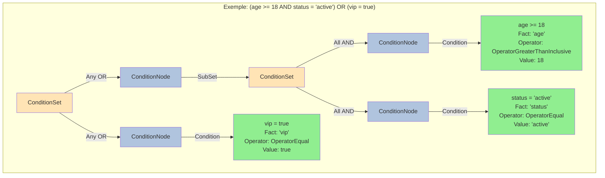
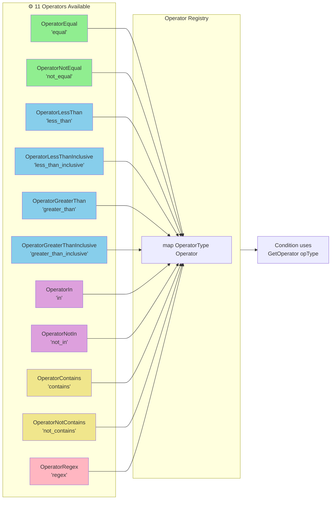
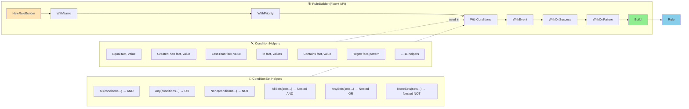
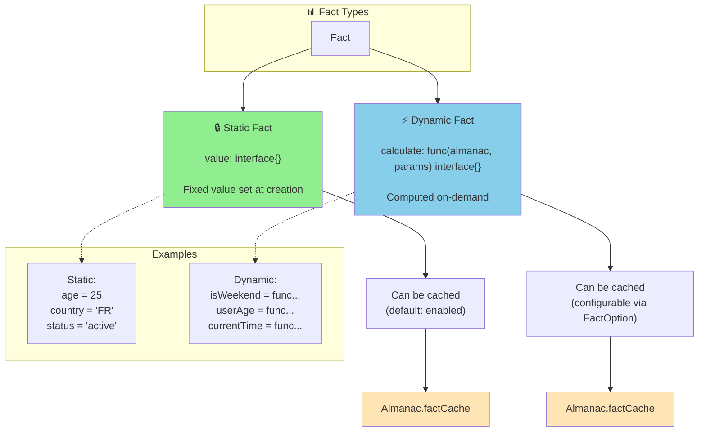
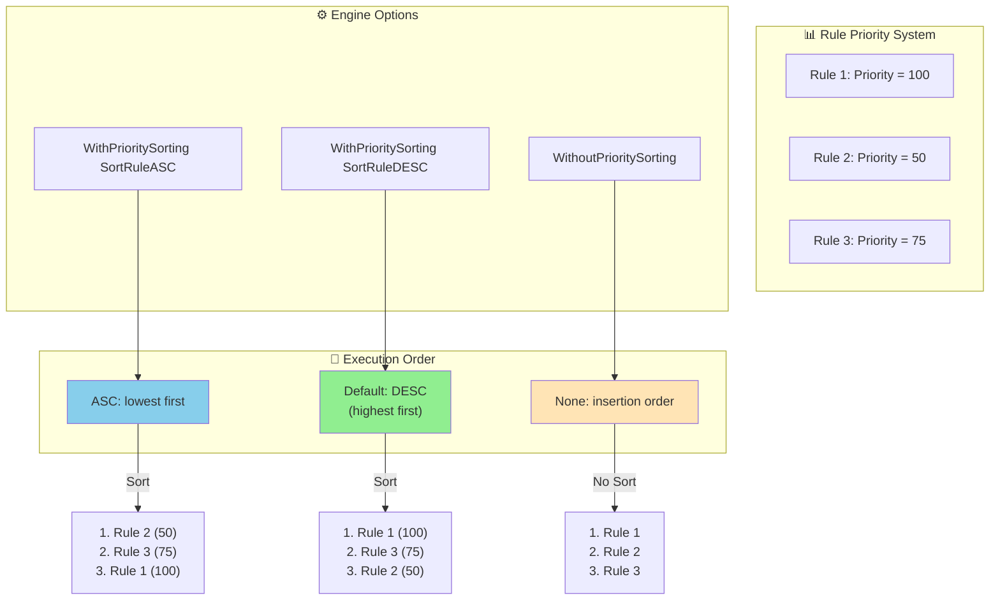

# Go Rules Engine - Architecture

## 1. Vue d'ensemble des composants

## 2. Flux d'exécution

## 3. Système d'événements

## 4. Structure des conditions (Arbre booléen)

## 5. Types d'opérateurs

## 6. Builder API (Fluent Interface)

## 7. Fact Types (Statique vs Dynamique)

## 8. Gestion de priorité

## Légende

- 🎯 Engine: Configuration et orchestration
- 📋 Almanac: Contexte d'exécution runtime
- 📜 Rule: Logique métier
- 🔀 ConditionSet: Groupement logique (AND/OR/NOT)
- ✓ Condition: Comparaison unique
- 📊 Fact: Source de données
- ⚙️ Operator: Logique de comparaison
- 🔔 Handler: Callback d'événement
- 🏗️ Builder: API ergonomique
