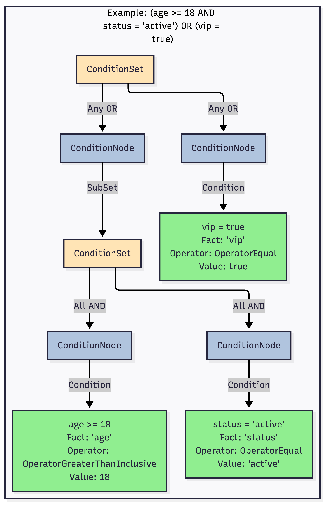
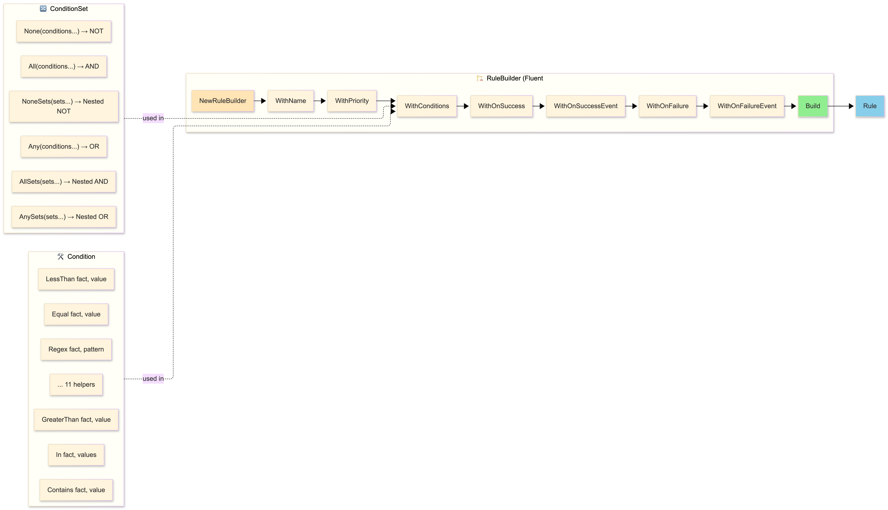
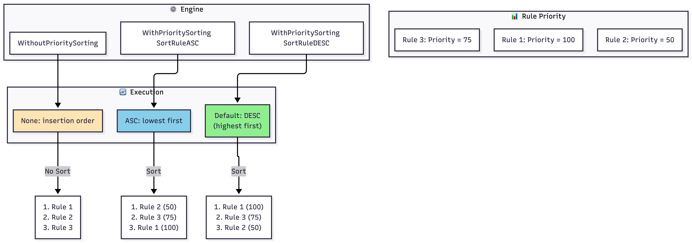

# Go Rules Engine - Architecture

This page details the internal architecture of the rules engine. Each section links to a source Mermaid diagram.

## 1. Component Overview
Visualization of data structures (Engine, Almanac, Rule, Fact, etc.) and their relationships.

> [📄 Source: 1_overview.mermaid](./1_overview.mermaid)

## 2. Execution Flow
Life cycle of a `Run()` call, including priority sorting, Smart Skip, and condition evaluation with caching.

> [📄 Source: 2_execution_flow.mermaid](./2_execution_flow.mermaid)

## 3. Event System
Mechanism for triggering synchronous and asynchronous events after rule evaluation.

> [📄 Source: 3_event_system.mermaid](./3_event_system.mermaid)

## 4. Condition Structure (Boolean Tree)
Example of deploying complex logic mixing `All`, `Any`, and `None` operators.

> [📄 Source: 4_condition_structure.mermaid](./4_condition_structure.mermaid)

## 5. Operator Types
List of the 11 built-in operators and the extension mechanism via the operator registry.

> [📄 Source: 5_operators.mermaid](./5_operators.mermaid)

## 6. Builder API (Fluent Interface)
Architecture of the Fluent API for programmatic rule construction.

> [📄 Source: 6_builder_api.mermaid](./6_builder_api.mermaid)

## 7. Fact Types (Static vs Dynamic)
Differences between static facts (fixed values) and dynamic facts (calculation functions), and their management in the cache.

> [📄 Source: 7_fact_types.mermaid](./7_fact_types.mermaid)

## 8. Priority Management
How the rule sorting system works before execution.

> [📄 Source: 8_priority_system.mermaid](./8_priority_system.mermaid)

---

## Legend
- 🎯 **Engine**: Configuration and orchestration
- 📋 **Almanac**: Runtime execution context
- 📜 **Rule**: Business logic
- 🔀 **ConditionSet**: Logical grouping (AND/OR/NOT)
- ✓ **Condition**: Single comparison
- 📊 **Fact**: Data source
- ⚙️ **Operator**: Comparison logic
- 🔔 **Handler**: Event callback
- 🏗️ **Builder**: Ergonomic API
